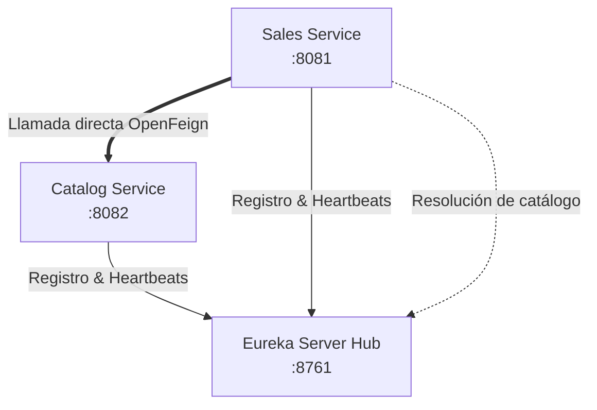
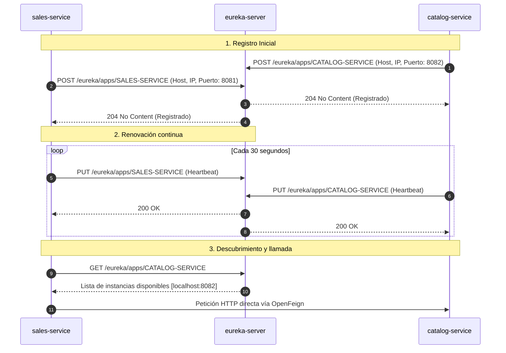

# Eureka Server

> Servidor central de **descubrimiento y registro de microservicios (Service Discovery Registry)** para la arquitectura distribuida de GameStore, desarrollado con Spring Cloud Netflix Eureka.


---

## Tabla de contenido

1. [Resumen del proyecto](#1-resumen-del-proyecto)
2. [Stack tecnológico y por qué se eligió](#2-stack-tecnológico-y-por-qué-se-eligió)
3. [Ecosistema de microservicios](#3-ecosistema-de-microservicios)
4. [Decisiones de arquitectura](#4-decisiones-de-arquitectura)
5. [Arquitectura y funcionamiento interno](#5-arquitectura-y-funcionamiento-interno)
6. [Ciclo de vida de registro y descubrimiento](#6-ciclo-de-vida-de-registro-y-descubrimiento)
7. [Estructura del proyecto](#7-estructura-del-proyecto)
8. [Dashboard web de monitoreo](#8-dashboard-web-de-monitoreo)
9. [Referencia de la API de Eureka](#9-referencia-de-la-api-de-eureka)
10. [Manejo de resiliencia y fallas](#10-manejo-de-resiliencia-y-fallas)
11. [Configuración](#11-configuración)
12. [Instalación y ejecución](#12-instalación-y-ejecución)
13. [Guía de pruebas y verificación](#13-guía-de-pruebas-y-verificación)
14. [Solución de problemas](#14-solución-de-problemas)
15. [Mejoras futuras](#15-mejoras-futuras)

---

## 1. Resumen del proyecto

`eureka-server` actúa como el **directorio telefónico central** de todo el ecosistema de microservicios:

| Responsabilidad | Descripción |
|---|---|
| Registro dinámico de servicios | Recibe y almacena metadatos (nombre lógico, IP, puerto) de cada servicio al arrancar. |
| Monitoreo de disponibilidad (Heartbeats) | Supervisa la salud de los servicios mediante latidos periódicos cada 30 segundos. |
| Resolución de nombres | Traduce nombres lógicos (`CATALOG-SERVICE`) a direcciones físicas en tiempo real para OpenFeign. |
| Panel de control visual | Proporciona una interfaz web interactiva para visualizar las instancias activas del clúster. |

**¿Por qué es indispensable?** En una arquitectura moderna con contenedores Docker o nubes elásticas, las IPs y puertos cambian permanentemente. Eureka desacopla la ubicación física de los microservicios, haciendo posible el escalado horizontal y la alta disponibilidad sin reconfigurar clientes.

---

## 2. Stack tecnológico y por qué se eligió

| Tecnología | Versión | Función | ¿Por qué se usa? |
|---|---|---|---|
| Java | 17 | Lenguaje | Versión LTS compatible con Spring Boot y Spring Cloud modernos. |
| Spring Boot | 4.1.1 | Framework base | Arranque rápido, servidor embebido y gestión de ciclo de vida. |
| Spring Cloud Netflix Eureka Server | 2025.1.3 | Motor de descubrimiento | Servidor de registro estándar y maduro en el ecosistema Spring Cloud. |
| Maven Wrapper | — | Gestor de compilación | Garantiza una compilación idéntica en cualquier máquina sin necesidad de instalar Maven globalmente. |

---

## 3. Ecosistema de microservicios

`eureka-server` es el nodo raíz sobre el que operan los microservicios de negocio:

| Servicio | Puerto | Base de datos | Rol | Repositorio |
|---|---|---|---|---|
| `eureka-server` | 8761 | — | Directorio de servicios (Service Discovery) | *(este repositorio)* |
| `catalog-service` | 8082 | MongoDB | Catálogo e inventario NoSQL | [Alger125/catalog-service](https://github.com/Alger125/catalog-service) |
| `sales-service` | 8081 | H2 (SQL) | Ventas y facturación | [Alger125/sales-service](https://github.com/Alger125/sales-service) |

### Diagrama de topología de red



---

## 4. Decisiones de arquitectura

### 4.1 Desacoplamiento de infraestructura vs URLs fijas (Hardcoded)
- Sin un servidor de descubrimiento, `sales-service` tendría que configurar URLs como `http://192.168.1.100:8082`.
- Si el contenedor del catálogo se reinicia en otra IP o se despliega una segunda réplica, el sistema se rompería.
- Con Eureka, los clientes solo invocan el nombre virtual `http://catalog-service`.

### 4.2 Balanceo de carga del lado del cliente (Client-Side Load Balancing)
- Eureka entrega a los clientes (vía OpenFeign y Spring Cloud LoadBalancer) la lista de todas las instancias saludables.
- El propio cliente decide a qué réplica enviar la petición, eliminando la necesidad de balanceadores de carga de hardware intermedios costosos.

### 4.3 Almacenamiento en memoria ultrarrápido
- El registro de instancias reside en memoria RAM dentro del servidor Eureka.
- Esto permite resoluciones de nombres en microsegundos sin sobrecargar bases de datos secundarias.

---

## 5. Arquitectura y funcionamiento interno

```mermaid
flowchart LR
    subgraph Eureka Server
        REG[Registro en Memoria]
        EVICT[Eviction Timer<br/>(Temporizador de desalojo)]
        DASH[Web Dashboard<br/>:8761]
    end

    CLIENT[Cliente Eureka] -->|POST /apps| REG
    CLIENT -->|PUT /apps (Heartbeat)| REG
    EVICT -->|Elimina instancias caídas| REG
    REG --> DASH
```

### Componentes internos:
1. **Instance Registry:** Tabla hash concurrente en memoria donde se indexan las instancias por nombre de aplicación en mayúsculas (`SALES-SERVICE`, `CATALOG-SERVICE`).
2. **Heartbeat Receiver:** Endpoint REST que procesa las renovaciones de arrendamiento enviadas periódicamente por los clientes.
3. **Eviction Task:** Proceso en segundo plano que remueve instancias que dejaron de enviar señales de vida durante el período de tolerancia (90 segundos).

---

## 6. Ciclo de vida de registro y descubrimiento



---

## 7. Estructura del proyecto

```
eureka-server/
├── .mvn/wrapper/                    # Maven Wrapper para compilación sin instalación local
├── src/
│   ├── main/
│   │   ├── java/com/jonathan/gamestore/eureka/
│   │   │   └── EurekaServerApplication.java   # Clase principal con @EnableEurekaServer
│   │   └── resources/
│   │       └── application.properties         # Configuración del servidor y puerto 8761
│   └── test/
│       └── java/com/jonathan/gamestore/eureka/
│           └── EurekaServerApplicationTests.java
├── mvnw / mvnw.cmd          # Scripts de arranque multiplataforma
├── pom.xml                  # Dependencias de Spring Cloud Eureka Server
└── README.md
```

### Clase principal: `EurekaServerApplication.java`
```java
@SpringBootApplication
@EnableEurekaServer
public class EurekaServerApplication {
    public static void main(String[] args) {
        SpringApplication.run(EurekaServerApplication.class, args);
    }
}
```
* `@EnableEurekaServer`: Anotación angular que activa el servlet dispatcher de Netflix, los endpoints REST del registro y la interfaz gráfica de administración.

---

## 8. Dashboard web de monitoreo

Al levantar el servicio, la interfaz gráfica está disponible en:  
**URL:** [http://localhost:8761](http://localhost:8761)

### Secciones clave del panel:
* **System Status:** Memoria consumida, tiempo encendido (uptime) y entorno de ejecución.
* **Instances currently registered with Eureka:** Muestra una tabla con cada microservicio registrado, su nombre en mayúsculas, cantidad de réplicas y estado (`UP (1) - 192.168.1.X:puerto`).
* **General Info:** Estado de la renovación de arrendamientos y modo de protección.

---

## 9. Referencia de la API de Eureka

Aunque los microservicios se comunican mediante los starters de Spring Cloud, Eureka expone endpoints HTTP directos:

| Método | Ruta | Formato | Descripción |
|---|---|---|---|
| `GET` | `/eureka/apps` | XML / JSON | Lista todas las aplicaciones registradas y sus réplicas vivas. |
| `GET` | `/eureka/apps/{appName}` | XML / JSON | Metadatos y direcciones de una aplicación específica. |
| `POST` | `/eureka/apps/{appName}` | JSON | Registro manual de una nueva instancia. |
| `PUT` | `/eureka/apps/{appName}/{instanceId}` | — | Renovación de arrendamiento (Heartbeat). |
| `DELETE` | `/eureka/apps/{appName}/{instanceId}` | — | Cancelación de registro al apagarse un servicio. |

---

## 10. Manejo de resiliencia y fallas

### Modo de Autoconservación (Self-Preservation Mode)
* **¿Qué es?** Si ocurre una desconexión de red entre servidores, muchos servicios podrían fallar en enviar sus heartbeats de golpe.
* **Comportamiento:** En lugar de asumir que todos los microservicios murieron y vaciar la agenda, Eureka activa el modo de autoconservación: **mantiene vivas las instancias en el registro** hasta que la red se estabilice.
* **Mensaje característico en el Dashboard:**  
  *`EMERGENCY! EUREKA MAY BE INCORRECTLY CLAIMING INSTANCES ARE UP WHEN THEY'RE NOT.`*

---

## 11. Configuración

Archivo: `src/main/resources/application.properties`

```properties
spring.application.name=eureka-server
server.port=8761

# Deshabilita el auto-registro: Eureka es el registro, no un cliente consumidor
eureka.client.register-with-eureka=false

# Deshabilita la sincronización con pares (modo nodo único para desarrollo)
eureka.client.fetch-registry=false

# Registro de logs
logging.level.com.netflix.eureka=INFO
logging.level.org.springframework.cloud=INFO
```

---

## 12. Instalación y ejecución

### Requisitos previos
- **JDK 17** o superior (`java -version`).
- Puerto `8761` disponible.

### Paso 1. Clonar el repositorio
```bash
git clone https://github.com/Alger125/eureka-server.git
cd eureka-server
```

### Paso 2. Iniciar con Maven Wrapper
```bash
./mvnw spring-boot:run          # Windows: .\mvnw.cmd spring-boot:run
```

### Alternativa: Ejecución de JAR con optimización de memoria (256MB)
```bash
./mvnw clean package -DskipTests
java -Xmx256m -jar target/eureka-server-0.0.1-SNAPSHOT.jar
```

---

## 13. Guía de pruebas y verificación

### 1. Comprobación vía navegador web
Abrir [http://localhost:8761](http://localhost:8761) y verificar que cargue la interfaz de Spring Eureka.

### 2. Consulta de aplicaciones registradas vía PowerShell
```powershell
Invoke-RestMethod -Uri "http://localhost:8761/eureka/apps" -Headers @{"Accept"="application/json"} | ConvertTo-Json -Depth 4
```

---

## 14. Solución de problemas

| Síntoma | Causa probable | Solución |
|---|---|---|
| `Port 8761 is already in use` | Ya hay una instancia previa corriendo o un proceso ocupa el puerto. | Detener el proceso anterior en el Administrador de Tareas o cambiar el puerto en `application.properties`. |
| Las instancias no aparecen en el Dashboard | `catalog-service` o `sales-service` no tienen configurado `eureka.client.service-url.defaultZone`. | Verificar que los otros servicios apunten a `http://localhost:8761/eureka/`. |
| Alerta roja de Self-Preservation | Varios servicios se detuvieron abruptamente en desarrollo local. | Normal en entornos de desarrollo; desaparece al reiniciar Eureka o volver a encender los servicios. |

---

## 15. Mejoras futuras

- **Alta disponibilidad (Peer Awareness / Clúster):** desplegar múltiples nodos de Eureka en réplica cruzada para eliminar el punto único de fallo en producción.
- **Seguridad perimetral:** proteger el acceso al panel y endpoints de Eureka mediante Spring Security con credenciales HTTP Basic.
- **Integración con Spring Cloud Gateway:** exponer el ecosistema al mundo exterior a través de una pasarela unificada enrutada por Eureka.
- **Contenedor Docker:** empaquetado en imagen `Dockerfile` liviana y despliegue automatizado con `docker-compose.yml`.

---

## Autor

**Alger125** · [github.com/Alger125](https://github.com/Alger125)
